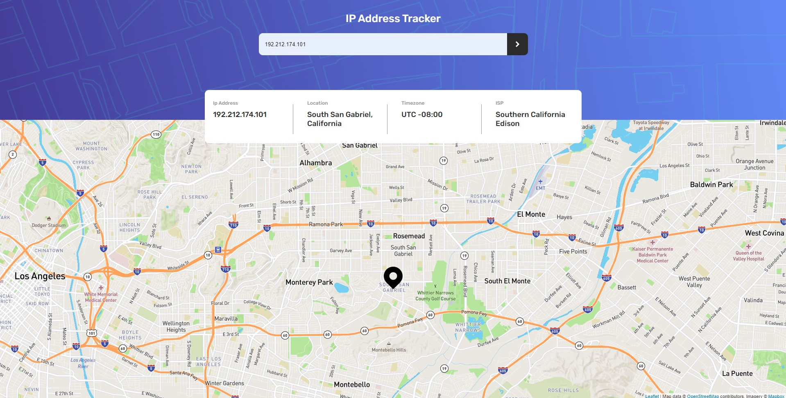

# Frontend Mentor - IP address tracker solution

This is a solution to the [IP address tracker challenge on Frontend Mentor](https://www.frontendmentor.io/challenges/ip-address-tracker-I8-0yYAH0). Frontend Mentor challenges help you improve your coding skills by building realistic projects.

## Table of contents

- [Overview](#overview)
  - [The challenge](#the-challenge)
  - [Screenshot](#screenshot)
  - [Links](#links)
- [My process](#my-process)
  - [Built with](#built-with)
  - [What I learned](#what-i-learned)
  - [Continued development](#continued-development)
  - [Useful resources](#useful-resources)

**Note: Delete this note and update the table of contents based on what sections you keep.**

## Overview

### The challenge

Users should be able to:

- View the optimal layout for each page depending on their device's screen size
- See hover states for all interactive elements on the page
- See their own IP address on the map on the initial page load
- Search for any IP addresses or domains and see the key information and location

### Screenshot



### Links

- Solution URL: [Add solution URL here](https://github.com/LawrenceJ1/ip-address-tracker)
- Live Site URL: [Add live site URL here](https://your-live-site-url.com)

## My process

### Built with

- CSS custom properties
- Flexbox
- [React](https://reactjs.org/) - JS framework
- [Leaflet](https://leafletjs.com/) - JS library for maps
- [GeoIpAPI](https://geo.ipify.org/) - API for ip addresses

### What I learned

One of the most important things I learned was how to flash error messages without external node packages. This can be seen
in the following code blocks:

```jsx
{
  flash && (
    <div className={`${styles.flashMessage} ${fadeOut && styles.hidden}`}>
      Inavlid Input
    </div>
  );
}
```

```css
.flashMessage {
  font-size: 24px;
  position: absolute;
  margin-top: 95vh;
  border: 2px solid rgb(223, 118, 118);
  text-align: center;
  width: 95vw;
  border-radius: 5px;
  background-color: rgb(223, 118, 118);
}

.hidden {
  visibility: hidden;
  opacity: 0;
  transition: visibility 0s 2s, opacity 2s linear;
}
```

```js
try {
  let x = promise.location.lat;
} catch {
  setFlash(true);
  setTimeout(() => setFadeOut(true), 1000);
  setTimeout(() => setFlash(false), 3000);
  setFadeOut(false);
  return;
}
```

I also learned how to work with APIs like the GeoIp API, as well as strengthened my ability to work with JS libraries. This
was the first time I used React to build a site, and I'm pretty pleased with how it turned out.

### Continued development

Use this section to outline areas that you want to continue focusing on in future projects. These could be concepts you're still not completely comfortable with or techniques you found useful that you want to refine and perfect.

**Note: Delete this note and the content within this section and replace with your own plans for continued development.**

### Useful resources

- [Example resource 1](https://www.example.com) - This helped me for XYZ reason. I really liked this pattern and will use it going forward.
- [Example resource 2](https://www.example.com) - This is an amazing article which helped me finally understand XYZ. I'd recommend it to anyone still learning this concept.

**Note: Delete this note and replace the list above with resources that helped you during the challenge. These could come in handy for anyone viewing your solution or for yourself when you look back on this project in the future.**
